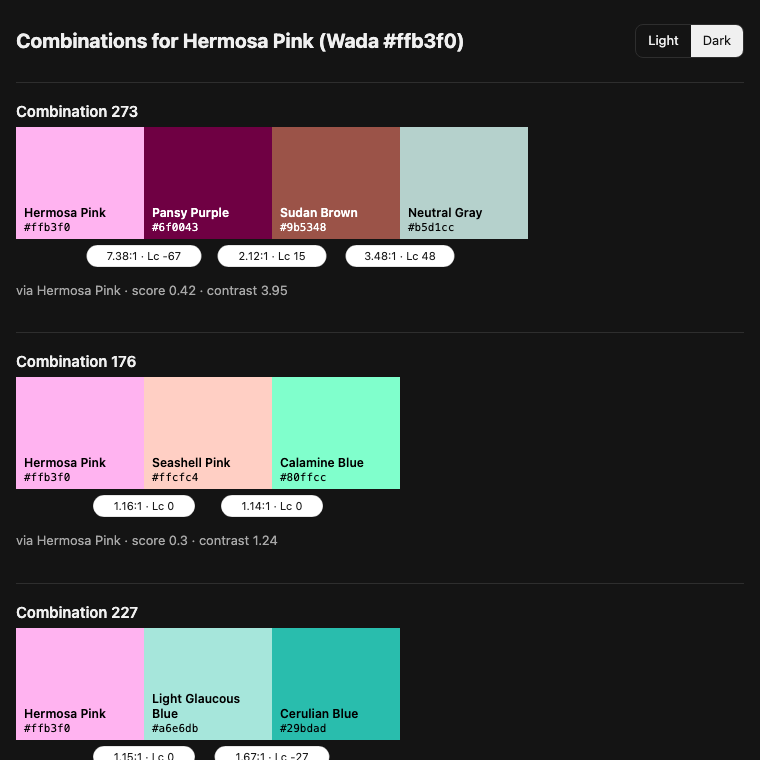

# @thesnug/color-picker

Color palettes drawn from Sanzo Wada's *A Dictionary of Color Combinations*, and
garment color recommendations for print-on-demand designs. A deterministic
TypeScript library with a CLI and an MCP server. No framework, no AI in the core.

The design and its reasons are in [docs/DESIGN.md](docs/DESIGN.md). How work is
organized is in [AGENTS.md](AGENTS.md).

## Install

The package is consumed as a git dependency pinned to a release tag. Releases
commit `dist/`, so installs need no compiler.

```bash
npm install github:thesnug/color-picker#vX.Y.Z
```

Or in `package.json`:

```json
{
  "dependencies": {
    "@thesnug/color-picker": "github:thesnug/color-picker#vX.Y.Z"
  }
}
```

Requires Node 20 or later. The package is ESM only.

Upgrade deliberately by moving the tag. Releases are listed at
https://github.com/thesnug/color-picker/tags.

## Entry points

| Entry point | Contents |
| --- | --- |
| `@thesnug/color-picker` | Color math, nearest match, combinations, recommendations, recolor plans |
| `@thesnug/color-picker/data` | The JSON assets, typed |
| `@thesnug/color-picker/render` | SVG, HTML, and terminal swatch renderers |
| `@thesnug/color-picker/fingerprint` | Design fingerprints from image files |
| `bin: color-picker` | CLI |
| `bin: color-picker-mcp` | MCP server |

```ts
import { normalizeHex } from "@thesnug/color-picker";
import { loadWadaColors } from "@thesnug/color-picker/data";
import { renderSwatchStripSvg } from "@thesnug/color-picker/render";
```

### Nearest match

`nearest` finds the closest Wada colors to a hex code or a color name by OKLab
distance (scaled by 100; about 2 is a just-noticeable difference):

```ts
import { nearest } from "@thesnug/color-picker";

nearest("#c0737a");                  // top 3, sorted by distance
nearest("dusty rose", { within: 8 }); // every match within 8
nearest("not a color");               // { matches: [], reason: "Unknown color name ..." }
```

Names are matched ignoring case, spacing, and punctuation, with "grey" read as
"gray". Wada names and aliases come first, then CSS named colors, then the xkcd
color survey.

### Combinations

`combinations` returns ranked palettes for any color: the book's combinations for
the nearest match, plus those of the second and third matches when they are
within 6. When the book gives fewer than 6 palettes, it adds complementary,
split-complementary, triadic, and analogous harmonies computed in OKLCH and
snapped to Wada colors.

```ts
import { combinations } from "@thesnug/color-picker";

combinations("Hermosa Pink");            // book palettes: 176, 227, 273, then neighbors'
combinations("#c0737a", { size: 3 });    // three-color palettes only
combinations("#808080").anchor;          // { color: Deep Violet, via: "nearest-neutral", ... }
```

Book palettes come first, grouped by which match they came from, then
harmonies. Each palette carries a `score` from 0 to 1 (contrast against the
matched color, weighted three to one over hue spread) with its `contrast` and
`hueSpread`, so callers can re-rank. A neutral input anchors on the nearest
neutral Wada color, so a gray does not anchor on a tinted color.

### Design fingerprint

`fingerprint` reduces a PNG, WebP, or JPEG design to what recommendations need:
the SHA-256 of the file, its top five colors by coverage, its ink luminance,
whether it has transparency, and its size.

```ts
import { fingerprint } from "@thesnug/color-picker/fingerprint";

const design = await fingerprint("art/light-ink.png");
// {
//   hash: "ecea6a60…",
//   palette: [{ hex: "#e8836b", oklab: {…}, share: 0.509 }, { hex: "#f3e9d2", …, share: 0.491 }],
//   inkLuminance: 0.57707,
//   hasTransparency: true,
//   width: 256,
//   height: 256,
// }
```

- `palette`: pixels above half opacity, quantized in OKLab (median cut, then
  k-means). Colors closer than `mergeDistance` (default 5) merge, and antialiased
  edges between two colors fold into those colors, so a flat two-color mark comes
  back as two colors. `share` is a fraction of all opaque coverage.
- `inkLuminance`: the same measure as `measureInk` in maker-method-picker, the
  alpha-weighted mean WCAG luminance of every visible pixel, 0 to 1.
- Images are sampled at up to 512 px on the long side (`maxDimension`).
- Results are cached as JSON under `$XDG_CACHE_HOME/color-picker/fingerprints`
  (or `~/.cache/…`), keyed by file hash and settings, so a repeat call skips
  decoding. Pass `cache: "some/dir"` to move it or `cache: false` to skip it.

Decoding uses `sharp`, an optional peer dependency. Install it next to this
package, or pass `decoder` with your own:

```bash
npm install sharp
```

### Recommend garment colors

`recommendProductColors` ranks a product's colors for a design printed as is.
It takes a fingerprint, or any `{ palette, inkLuminance }`, and returns the best
`n` picks (default 5), each with a `score`, plain-language `reasons`, and
`warnings`:

```ts
import { recommendProductColors } from "@thesnug/color-picker";
import { fingerprint } from "@thesnug/color-picker/fingerprint";

const picks = recommendProductColors(await fingerprint("art/light-ink.png"), { n: 3 });
picks[0].color.name;  // "Graphite"
picks[0].reasons[0];  // "Both design colors clear 4.5:1 on Graphite; #e8836b (near Apricot Orange) is the closest at 4.74:1."
```

The score adds four components, each from 0 to 1 and exposed on `components`:

| Component | Measures | Default weight |
| --- | --- | --- |
| `contrast` | Each design color's WCAG contrast against the garment, as progress toward 4.5:1, weighted by coverage | 0.6 |
| `vanish` | Coverage of design colors closer to the garment than the print minimum distance (subtracted) | 0.6 |
| `inkFit` | Dark ink on a light garment, or light ink on a dark one, by the dark-ink luminance cutoff | 0.3 |
| `bookPairing` | The garment's and the design's dominant Wada colors share a book combination | 0.1 |

The weights are `RECOMMEND_WEIGHTS`. Pass `weights` to change them, or call
`scoreComponents(pick.components, weights)` to re-rank existing picks without
analyzing the design again. Options: `product` (an ID or a loaded product;
default Comfort Colors 1717) and `availableOnly` (default true).

### CLI

`color-picker` answers the same questions from the command line and shows
swatches, not just hex. It uses only Node built-ins, so it adds no dependencies.

```bash
color-picker nearest "#c0737a"                # the 3 closest Wada colors
color-picker nearest "dusty rose" -k 5        # names work too; quote spaces
color-picker combos "hermosa pink" --size 3   # ranked three-color palettes
color-picker combos "#808080" --limit 4       # a gray anchors on a neutral
color-picker show 176 227                     # book combinations by ID
color-picker recommend art/light-ink.png -n 3 # garment colors for a design
```

```text
$ color-picker combos "hermosa pink" --size 3 --limit 1
Combinations for Hermosa Pink (Wada #ffb3f0)
Anchor: Hermosa Pink #ffb3f0 (distance 0)

Combination 176 · via Hermosa Pink · score 0.3 · contrast 1.24
██████  #ffb3f0  Hermosa Pink
██████  #ffcfc4  Seashell Pink
██████  #80ffcc  Calamine Blue
```

In a terminal each line starts with a truecolor block. Color is off when
output is piped or `NO_COLOR` is set.

| Flag | Applies to | Effect |
| --- | --- | --- |
| `-k <n>` | `nearest` | Number of matches (default 3) |
| `--size <n>` | `combos` | Only palettes with `n` colors |
| `--limit <n>` | `combos` | Maximum palettes (default 8) |
| `-n <n>` | `recommend` | Number of picks (default 5) |
| `--product <id>` | `recommend` | Garment product (default `comfort-colors-1717`) |
| `--json` | any | Print the library result as JSON instead of text |
| `--svg <path>` | any | Write the swatches as one SVG file |
| `--html <path>` | any | Write a self-contained HTML review page |
| `--check` | reserved | Coming in the products milestone |

`--svg` and `--html` still print the text result, and report the file written
on stderr, so `--json` output stays clean for piping. The HTML page has a
light and dark background toggle:

```bash
color-picker combos "hermosa pink" --limit 4 --html review.html
```



For `recommend`, the HTML page shows each pick as a product card, with the
garment photo when the product has one and the design's colors as chips beside
it. Warnings name the design colors that would vanish into the shirt.

Exit codes: `0` on success; `1` for an unknown name, a malformed hex, an
unknown combination ID or product, or a design file that cannot be read; `2`
for a usage error such as a missing argument or a reserved flag.

### MCP server

The MCP server depends on `@modelcontextprotocol/sdk`, declared as an optional
peer dependency so consumers that import only the core never install it. Add it
next to this package to run the server:

```bash
npm install @modelcontextprotocol/sdk
npx color-picker-mcp
```

The server speaks MCP over stdio. Register it with a client as the command
`color-picker-mcp`.

## Accessibility

`check` tests a combination against the thresholds in
[`assets/accessibility.json`](assets/accessibility.json): WCAG 2.2 and APCA
contrast for every ordered pair, the minimum distance between colors printed
together, and whether any pair collapses under protanopia, deuteranopia, or
tritanopia. `roles` picks a legible background, text, and accent for a web page,
or says why none exists. Every result carries plain-language `reasons`.

```ts
import { check, roles } from "@thesnug/color-picker";

check(["#1c1c1c", "#fbf7ef", "#c8102e"], { context: "web-text" }); // or "web-ui", "print"
roles(combination, { mode: "dark" }); // a book combination or a list of colors
```

The numbers live in the JSON, each with its source; the code only applies them.

## Development

```bash
npm ci
npm test          # vitest
npm run typecheck # tsc, no emit
npm run build     # tsc to dist/ with declarations
```

The sample designs in `tests/fixtures/designs/` are synthetic and generated by
`npx tsx scripts/make-design-fixtures.ts`.

`dist/` is ignored in git and is committed only by the release script at tag
time. CI runs typecheck, tests, and the build on pull requests and on `main`.

## Data

`assets/colors.json` is vendored from the open-source web edition of the
dictionary by Dain Blodorn Kim (https://github.com/dblodorn/sanzo-wada) and is
never edited by hand.

`scripts/build-data.ts` derives `assets/derived/colors.json` (cleaned names,
aliases, OKLab and OKLCH values) and `assets/derived/combinations.json` (one
object per combination with a harmony label). The name corrections are listed at
the top of the script. Both files are committed; CI fails when they are stale.

```bash
npm run data:build  # regenerate assets/derived/
npm run data:check  # fail if assets/derived/ is out of date
```

`assets/names/css.json` (CSS named colors) and `assets/names/xkcd.json` (the xkcd
color survey, CC0) are the name dictionaries `nearest` falls back to. Each file
records its source, license, and retrieval date. The xkcd names keep their
published UK spellings ("grey"); lookup treats "grey" as "gray".

### Products

Each garment product is one file in `assets/products/`, named for its ID. The
index, `assets/products/index.json`, lists every product and names the default:
Comfort Colors 1717. Files are checked against
`assets/schemas/product.schema.json`.

```ts
import { defaultProduct, loadProduct } from "@thesnug/color-picker/data";

defaultProduct();                  // Comfort Colors 1717
loadProduct("comfort-colors-1717");
```

To add a product:

1. Create `assets/products/<id>.json`, where `<id>` is a lowercase slug such as
   `gildan-5000`. Start with `"$schema": "../schemas/product.schema.json"` so
   editors validate as you type. Fill in `id` (matching the file name), `brand`,
   `model`, `name`, `printMethod`, and `printAreas` (position, width and height in
   inches).
2. Add `{ "id": "<id>", "name": "<display name>" }` to `products` in
   `assets/products/index.json`.
3. Add colors. Each carries `source` (`printify`, `retail-chart:<name>`, or
   `reviewed`) and a `sourceDate`. Colors the provider does not stock get
   `"available": false`. Garment images are referenced by `image.url` and
   `image.sha256`, never stored in the repo. Never overwrite a `reviewed` color
   from an import.
4. Run `npm run products:check`. It fails on schema errors, duplicate slugs, a
   `reviewed` color without a date, or a file missing from the index. CI runs it
   too.
5. Run `npm run products:equivalents` and commit the `<id>.equivalents.json` it
   writes.

```bash
npm run products:check  # validate assets/products/
```

### Wada equivalents

Each product color's three nearest Wada colors are computed once and committed in
`assets/products/<id>.equivalents.json`, so a shirt-name query never runs a nearest
match and the mapping is reviewable in a diff. Each entry, keyed by color slug,
holds the product hex, its OKLCH, its family, and the matches as
`{ index, name, distance }`. Colors with no hex are listed with no matches.

```ts
import { equivalentsFor } from "@thesnug/color-picker";

equivalentsFor("comfort-colors-1717", "blue-spruce")?.matches[0];
```

Rebuild after changing a product file or the derived Wada data. The build prints
the spread of best-match distances and every color whose best match is farther than
10. CI fails when a committed file is stale.

```bash
npm run products:equivalents        # write assets/products/*.equivalents.json
npm run products:equivalents:check  # exit 1 if stale
```

### Refreshing product colors

`scripts/import-printify.ts` fills `assets/products/comfort-colors-1717.json` from
Printify directly: blueprint 706 (Comfort Colors 1717) from print provider 99
(Printify Choice), the provider on POD's 1717 template. The catalog lists which
colors are stocked, including those temporarily out of stock. It has no hex values,
so swatches come from the color option of existing shop products on the same
blueprint, as POD does. See docs/DESIGN.md, "Hex provenance for Comfort Colors 1717".

```bash
PRINTIFY_API_TOKEN=... npm run products:import -- \
  --color-study ../maker-method-picker/app/prototype/color-study/colors.json
npm run products:check
npm run products:equivalents
```

- The token is read from the environment only. Never commit it.
- Every color gets `source: "printify"`, today's `sourceDate`, and a `family` from
  `colorFamily`. A rerun with unchanged upstream data writes no diff; `--touch`
  moves `sourceDate` to today on every Printify color. `--dry-run` prints the log
  without writing.
- `reviewed` colors keep their hex. When Printify's swatch differs, the script
  prints both values so the drift is visible.
- A color that Printify no longer lists is set to `"available": false`, never
  deleted, and the script says so.
- `--color-study` takes the path to the maker-method-picker's color study. For
  each color found there by name, its garment image `url` and `sha256` become
  `image` and its `colorAssetVersionId` becomes `pod`. Its hex values are not used.
  The file is read in place, not copied into this repo.
- Printify spells one color "Grey". The name stays as Printify has it, with "Gray"
  as an alias.

## License

MIT.
