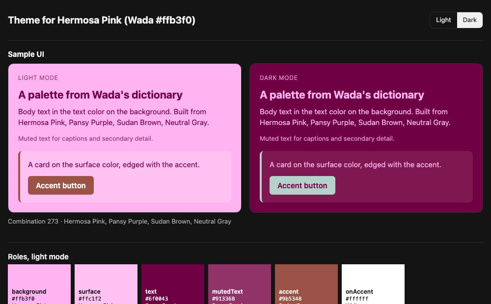

# @thesnug/color-picker

Color palettes drawn from Sanzo Wada's *A Dictionary of Color Combinations*, and
garment color recommendations for print-on-demand designs. A deterministic
TypeScript library with a CLI and an MCP server. No framework, no AI in the core.

The design and its reasons are in [docs/DESIGN.md](docs/DESIGN.md). How work is
organized is in [AGENTS.md](AGENTS.md).

## Install

The package is consumed as a git dependency pinned to a release tag. Releases
commit `dist/`, so installs need no compiler.

```bash
npm install github:thesnug/color-picker#v0.1.0
```

Or in `package.json`:

```json
{
  "dependencies": {
    "@thesnug/color-picker": "github:thesnug/color-picker#v0.1.0"
  }
}
```

Requires Node 20 or later. The package is ESM only.

Upgrade deliberately by moving the tag. Releases are listed at
https://github.com/thesnug/color-picker/tags, and what changed in each is in
[CHANGELOG.md](CHANGELOG.md).

## Entry points

| Entry point | Contents |
| --- | --- |
| `@thesnug/color-picker` | Color math, nearest match, combinations, web themes and ramps, recommendations, recolor plans |
| `@thesnug/color-picker/data` | The JSON assets, typed |
| `@thesnug/color-picker/render` | SVG, HTML, and terminal swatch renderers |
| `@thesnug/color-picker/fingerprint` | Design fingerprints from image files |
| `@thesnug/color-picker/jev` | The cached TypeSafe client that Jev judgments go through |
| `bin: color-picker` | CLI |
| `bin: color-picker-mcp` | MCP server |

```ts
import { normalizeHex } from "@thesnug/color-picker";
import { loadWadaColors } from "@thesnug/color-picker/data";
import { renderSwatchStripSvg } from "@thesnug/color-picker/render";
```

### Nearest match

`nearest` finds the closest Wada colors to a hex code or a color name by OKLab
distance (scaled by 100; about 2 is a just-noticeable difference):

```ts
import { nearest } from "@thesnug/color-picker";

nearest("#c0737a");                  // top 3, sorted by distance
nearest("dusty rose", { within: 8 }); // every match within 8
nearest("not a color");               // { matches: [], reason: "Unknown color name ..." }
```

Names are matched ignoring case, spacing, and punctuation, with "grey" read as
"gray". Wada names and aliases come first, then CSS named colors, then the xkcd
color survey.

### Combinations

`combinations` returns ranked palettes for any color: the book's combinations for
the nearest match, plus those of the second and third matches when they are
within 6. When the book gives fewer than 6 palettes, it adds complementary,
split-complementary, triadic, and analogous harmonies computed in OKLCH and
snapped to Wada colors.

```ts
import { combinations } from "@thesnug/color-picker";

combinations("Hermosa Pink");            // book palettes: 176, 227, 273, then neighbors'
combinations("#c0737a", { size: 3 });    // three-color palettes only
combinations("#808080").anchor;          // { color: Deep Violet, via: "nearest-neutral", ... }
```

Book palettes come first, grouped by which match they came from, then
harmonies. Each palette carries a `score` from 0 to 1 (contrast against the
matched color, weighted three to one over hue spread) with its `contrast` and
`hueSpread`, so callers can re-rank. A true gray anchors on the nearest neutral
Wada color when it is within 1.5 times the plain nearest distance, and
`anchor.rejected` names the candidate that lost. Pass `anchor` (a Wada index or
slug) to build palettes around a color you already have.

### Palettes for a garment color

`palettesForProductColor` answers "give me palettes for Blue Spruce". It finds
the product color by name, slug, or alias, ignoring case, and reads the
garment's committed Wada equivalents; it never runs a nearest match. Each
equivalent contributes its combinations: the nearest always, the others when
they are within 6 of the garment hex (`within`).

```ts
import { palettesForProductColor } from "@thesnug/color-picker";

const r = palettesForProductColor("Blue Spruce", { limit: 5 });
r.palettes[0].colors.map((c) => c.name);
// ["Blue Spruce", "Red Orange", "Pale Lemon Yellow", "Isabella Color"]
palettesForProductColor("gray").color?.name; // "Grey", through its alias
```

Each palette starts with the garment (`anchor: true`, the product hex, and the
garment image when there is one) in place of the Wada equivalent it came
through. The Wada colors to print on it follow. Palettes are ranked by the
mean WCAG contrast of those ink colors against the garment hex, not against
the Wada equivalent, because ink goes on the real shirt. Book palettes come
before harmonies, and a combination reached through two equivalents appears
once. `contrast` and `minContrast` are on every palette. Colors the provider
does not stock still work, and the result carries `available: false` so
callers can warn. Options: `product` (default Comfort Colors 1717), `limit`
(default 12), and `size` (the garment counts toward it).

### Design fingerprint

`fingerprint` reduces a PNG, WebP, or JPEG design to what recommendations need:
the SHA-256 of the file, its top five colors by coverage, its ink luminance,
whether it has transparency, and its size.

```ts
import { fingerprint } from "@thesnug/color-picker/fingerprint";

const design = await fingerprint("art/light-ink.png");
// {
//   hash: "ecea6a60…",
//   palette: [{ hex: "#e8836b", oklab: {…}, share: 0.509 }, { hex: "#f3e9d2", …, share: 0.491 }],
//   inkLuminance: 0.57707,
//   hasTransparency: true,
//   width: 256,
//   height: 256,
// }
```

- `palette`: pixels above half opacity, quantized in OKLab (median cut, then
  k-means). Colors closer than `mergeDistance` (default 5) merge, and antialiased
  edges between two colors fold into those colors, so a flat two-color mark comes
  back as two colors. `share` is a fraction of all opaque coverage.
- `inkLuminance`: the same measure as `measureInk` in maker-method-picker, the
  alpha-weighted mean WCAG luminance of every visible pixel, 0 to 1.
- Images are sampled at up to 512 px on the long side (`maxDimension`).
- Results are cached as JSON under `$XDG_CACHE_HOME/color-picker/fingerprints`
  (or `~/.cache/…`), keyed by file hash and settings, so a repeat call skips
  decoding. Pass `cache: "some/dir"` to move it or `cache: false` to skip it.

Decoding uses `sharp`, an optional peer dependency. Install it next to this
package, or pass `decoder` with your own:

```bash
npm install sharp
```

#### Vision description

`describeDesign` adds what the design depicts, so Jev (which is text-only) can
judge palettes and recolors against it: its subject and mood in a line each,
and its named elements, each tied to the palette color that paints it. Palette
colors gain `element`, which recolor plans and prompts name.

```ts
import { describeDesign, fingerprint } from "@thesnug/color-picker/fingerprint";

const design = await describeDesign(await fingerprint("art/flat-mark.png"), "art/flat-mark.png");
// design.description: {
//   subject: "A cream circle inside a coral ring.",
//   mood: "Warm, minimal, and retro.",
//   elements: [{ name: "outer ring", color: "coral", hex: "#e8836b" }, …],
//   provider: "codex",
//   model: "gpt-6-sol",
// }
// design.palette[0].element: "outer ring"
```

- Providers, tried in order: the Codex CLI (`codex exec`, on the machine's
  existing login, in a scratch directory with a read-only sandbox and without
  the user's `config.toml`), then OpenRouter when `OPENROUTER_API_KEY` is set.
  Both default to the same model (`gpt-6-sol`); set `OPENROUTER_MODEL` to change
  OpenRouter's. Pass `providers` to choose your own.
- One call per design: descriptions are cached next to the fingerprints, keyed by
  file hash and the exact prompt (including rounded palette coverage). The supplied
  file is checked against the fingerprint even on a cache hit; a valid cached
  description needs no provider.
- With no Codex login and no `OPENROUTER_API_KEY`, it throws
  `VisionUnavailableError`, naming each provider's failure and how to enable one.
### Jev client

Jev (TypeSafe System One) is used only for judgments code cannot make. Every Jev
call in this package goes through `ask`, which sends all of a feature's
questions about one state in a single request and caches the answers, so a
judgment is paid for once.

```ts
import { ask } from "@thesnug/color-picker/jev";

const { answers, cached } = await ask(
  { design: "A coral sun over cream waves", shirt: "Moss" },
  {
    legible: { type: "noul", instructions: "Does the ink read clearly on the shirt?" },
    mood: { type: "choice", instructions: "Which mood fits?", criteria: { playful: null, calm: null } },
  },
  { version: 1 },
);
answers.legible.noul; // probability of yes, 0 to 1
answers.mood.choice; // "playful" | "calm"
```

- Answers are cached as JSON under `$XDG_CACHE_HOME/color-picker/jev` (or
  `~/.cache/…`), keyed by the SHA-256 of `version`, the questions, and the state.
  Object key order does not matter. Bump `version` when a question's meaning
  changes to invalidate its answers. Pass `cache: COMMITTED_CACHE_DIR` to use
  the answers committed under `assets/cache/`, another directory, or `false` to
  skip the cache.
- A cache hit needs neither the SDK nor a key.
- On a miss, `ask` needs `@typesafe-ai/sdk`, an optional peer dependency, and
  `TYPESAFE_API_KEY` in the environment. Without either it throws
  `JevUnavailableError` with `reason` set to `"sdk-missing"` or
  `"api-key-missing"`. `jevAvailability()` checks both up front so a feature
  can skip Jev and say why.
- The key is read by the SDK from the environment only. This package never
  passes it, stores it, or logs it.

```bash
npm install @typesafe-ai/sdk
export TYPESAFE_API_KEY=...
```

### Words to color

`describeToColor` resolves a free-text description to a Wada color or a product
color. The name lookup runs first, and Jev is asked only when it misses.

```ts
import { describeToColor } from "@thesnug/color-picker/jev";

const wada = await describeToColor("something autumnal for a coffee brand");
const shirt = await describeToColor("the brick shirt", { set: "product" }); // Comfort Colors 1717 by default

if (shirt.via === "jev") {
  shirt.matches; // top three: [{ color, probability }, ...]
  shirt.confidence; // Jev's confidence in its top option
  shirt.none; // probability that the text is not a color at all
}
```

- A hex code, a Wada name or alias, a product color name, or a CSS or xkcd name
  resolves by name (`via: "name"`) with the closest colors by distance, and
  never reaches Jev.
- Anything else is one cached Choice request over every color in the set plus a
  `none` option. The result carries the probabilities and the confidence as Jev
  reported them; deciding when a spread is too flat to act on is the caller's job.
- `npm run jev:describe:evaluate` reports top-1 and top-3 accuracy on the labeled
  phrases in `tests/fixtures/jev/describe-color.json` against the live API. It
  needs a key and is never run in CI.

### Mood re-rank

`rerankByMood` takes candidates already ranked by the deterministic scoring
(garment recommendations or palettes for a garment) and asks Jev how well each
of the top ten suits the design's subject and mood. The design needs a vision
description first (`describeDesign`).

```ts
import { describeDesign, fingerprint } from "@thesnug/color-picker/fingerprint";
import { recommendProductColors } from "@thesnug/color-picker";
import { combineMood, rerankByMood } from "@thesnug/color-picker/jev";

const design = await describeDesign(await fingerprint("art/flat-mark.png"), "art/flat-mark.png");
const { candidates, applied, note } = await rerankByMood(recommendProductColors(design, { n: 10 }), design);

candidates[0].moodLevel;     // "clashes" | "neutral" | "complements" | "elevates"
candidates[0].moodScore;     // 0 to 1, or null when Jev was not asked
candidates[0].combinedScore; // shortlist place and mood score, weighted by MOOD_WEIGHT
combineMood(candidates, 0.7); // reweigh and re-sort without calling Jev again
```

- One cached request per shortlist: the state is the design's description and
  palette, with one Score question per candidate over four levels (clashes,
  neutral, complements, elevates).
- The deterministic side of `combinedScore` is the candidate's place in the
  shortlist, 1 for the first and 0 for the last, so garments and palettes
  combine the same way. `MOOD_WEIGHT` (0.4) is a starting value until the
  threshold evaluation sets it.
- Without a description, or when Jev is unavailable and the answer is not
  cached, the order is the deterministic one, `moodScore` is `null`, and `note`
  says why.

### Web themes

`theme` turns a combination into a UI theme. Background, text, and accent come
from the combination through `roles`; the surface and muted text are derived
from them. Every pairing is checked against WCAG 2.2 AA for its use, with APCA
reported alongside. When no pair of colors reaches 4.5:1, `theme` returns
`{ ok: false, reasons }` instead of throwing.

```ts
import { namedRamp, theme, toCssVariables, toDesignTokens, toTailwindTheme } from "@thesnug/color-picker";

const t = theme(["#1a1a40", "#f2e8cf", "#c74300"], { mode: "dark" });
if (t.ok) {
  t.colors.surface;   // { hex: "#22234a", derived: "Background shifted lighter" }
  t.pairings;         // text on background 13.6:1 AAA, accent on surface 3.01:1 AA, ...
  toCssVariables(t);  // :root { --color-background: #1a1a40; ...; --color-c74300-600: #c74300; ... }
  toTailwindTheme(t); // @theme { ... } for Tailwind v4
  toDesignTokens(t);  // W3C Design Tokens, format 2025.10
}

namedRamp("#c74300"); // 50 to 950; the input holds its own step (600 here)
```

| Role | Source | Must meet |
| --- | --- | --- |
| `background` | combination | |
| `surface` | background shifted in lightness to about 1.08:1 (light) or 1.2:1 (dark) | |
| `text` | combination | 4.5:1 on background and surface |
| `mutedText` | text mixed toward the background | 4.5:1 on background and surface |
| `accent` | the most chromatic combination member at 3:1, else the text color | 3:1 on background and surface |
| `onAccent` | background or text, else black or white | 4.5:1 on the accent |

Emitted CSS names are `--color-background`, `--color-surface`, `--color-text`,
`--color-text-muted`, `--color-accent`, and `--color-on-accent`, plus an
eleven-step ramp for each combination color named by its Wada name (or its hex
digits when it has none). Pass
`{ ramps: false }` to leave the ramps out. `namedRamp` holds hue, tapers chroma
toward white and black, and runs lightness evenly from 0.97 to 0.25 in OKLCH.
`ramp` from the color math is the unnamed version with constant chroma.

### Recommend garment colors

`recommendProductColors` ranks a product's colors for a design printed as is.
It takes a fingerprint, or any `{ palette, inkLuminance }`, and returns the best
`n` picks (default 5), each with a `score`, plain-language `reasons`, and
`warnings`:

```ts
import { recommendProductColors } from "@thesnug/color-picker";
import { fingerprint } from "@thesnug/color-picker/fingerprint";

const picks = recommendProductColors(await fingerprint("art/light-ink.png"), { n: 3 });
picks[0].color.name;  // "Graphite"
picks[0].reasons[0];  // "Both design colors clear 4.5:1 on Graphite; #e8836b (near Apricot Orange) is the closest at 4.74:1."
```

The score adds four components, each from 0 to 1 and exposed on `components`:

| Component | Measures | Default weight |
| --- | --- | --- |
| `contrast` | Each design color's WCAG contrast against the garment, as progress toward 4.5:1, weighted by coverage | 0.6 |
| `vanish` | Coverage of design colors closer to the garment than the print minimum distance (subtracted) | 0.6 |
| `inkFit` | Dark ink on a light garment, or light ink on a dark one, by the dark-ink luminance cutoff | 0.3 |
| `bookPairing` | The garment's and the design's dominant Wada colors share a book combination | 0.1 |

The weights are `RECOMMEND_WEIGHTS`. Pass `weights` to change them, or call
`scoreComponents(pick.components, weights)` to re-rank existing picks without
analyzing the design again. Options: `product` (an ID or a loaded product;
default Comfort Colors 1717) and `availableOnly` (default true).

### Recommend garment colors with recoloring

`recolorPlans` answers "which shirts would this design work on if I changed its
colors?" For each garment it picks a Wada combination around one of the
garment's stored equivalents, maps the design's colors onto the combination's
other members by lightness (darkest to darkest, so hierarchy survives), and
writes a prompt naming every swap:

```ts
import { recolorPlans } from "@thesnug/color-picker";
import { applyRecolor, fingerprint } from "@thesnug/color-picker/fingerprint";

const design = await fingerprint("art/flat-mark.png");
const [plan] = recolorPlans(design, { n: 5 });
plan.color.name;   // "Graphite"
plan.mapping[0];   // { from: { hex: "#e8836b", share: 0.5095 }, to: { index: …, name: "Ochraceous Salmon", hex: "#d99e73" } }
plan.prompt;       // "Recolor the artwork for a Graphite shirt: change the #e8836b areas to Ochraceous Salmon #d99e73; …"

await applyRecolor("art/flat-mark.png", plan.mapping, { out: "art/flat-mark-graphite.png", fingerprint: design });
```

Within a garment, a book combination with enough members beats a harmony,
and both beat a combination with fewer members, where neighbors in lightness
share an ink. Any plan where a new ink is within the print minimum distance of
the garment is `flagged` and used only when the garment has nothing else.
`score` adds `contrast` (0.6, as for `recommendProductColors`), subtracts
`vanish` (0.6), and adds `fidelity` (0.3), which favors the plan that changes
the design least; the weights are `RECOLOR_WEIGHTS`.

`applyRecolor` recolors flat-color art exactly: every visible pixel takes the
new ink of its nearest design color, keeping its alpha. When the fingerprint's
palette covers less than 90% of the design, or more than 5% of the pixels are
farther than 10 from every mapped color, the art counts as photographic and it
returns `{ applicable: false, reason }`; use the prompt instead.

### CLI

`color-picker` answers the same questions from the command line and shows
swatches, not just hex. It uses only Node built-ins, so it adds no dependencies.

```bash
color-picker nearest "#c0737a"                # the 3 closest Wada colors
color-picker nearest "dusty rose" -k 5        # names work too; quote spaces
color-picker combos "hermosa pink" --size 3   # ranked three-color palettes
color-picker combos "#808080" --limit 4       # a gray anchors on a neutral
color-picker show 176 227                     # book combinations by ID
color-picker palettes "Blue Spruce"           # palettes for a garment color
color-picker recommend art/light-ink.png -n 3 # garment colors for a design
color-picker recommend art/light-ink.png --mood  # re-ranked by mood with Jev
color-picker palettes "Black" --mood --design art/light-ink.png
color-picker recolor art/flat-mark.png --apply out/  # with recoloring
color-picker theme 348                        # a web theme from a combination
color-picker theme "hermosa pink" --format css
color-picker theme "#1a1a40" --mode dark --format tailwind
```

```text
$ color-picker combos "hermosa pink" --size 3 --limit 1
Combinations for Hermosa Pink (Wada #ffb3f0)
Anchor: Hermosa Pink #ffb3f0 (distance 0)

Combination 176 · via Hermosa Pink · score 0.3 · contrast 1.24
██████  #ffb3f0  Hermosa Pink
██████  #ffcfc4  Seashell Pink
██████  #80ffcc  Calamine Blue
```

In a terminal each line starts with a truecolor block. Color is off when
output is piped or `NO_COLOR` is set.

| Flag | Applies to | Effect |
| --- | --- | --- |
| `-k <n>` | `nearest` | Number of matches (default 3) |
| `--size <n>` | `combos`, `palettes` | Only palettes with `n` colors |
| `--limit <n>` | `combos`, `palettes` | Maximum palettes (default 8) |
| `-n <n>` | `recommend` | Number of picks (default 5) |
| `--product <id>` | `recommend`, `palettes` | Garment product (default `comfort-colors-1717`) |
| `--format <css\|tailwind\|tokens>` | `theme` | Print CSS custom properties, a Tailwind v4 `@theme` block, or design tokens |
| `--mode <light\|dark>` | `theme` | Light (default) or dark |
| `--json` | any | Print the library result as JSON instead of text |
| `--svg <path>` | any | Write the swatches as one SVG file |
| `--html <path>` | any | Write a self-contained HTML review page |
| `--check` | reserved | Coming in the products milestone |

`--svg` and `--html` still print the text result, and report the file written
on stderr, so `--json` output stays clean for piping. The HTML page has a
light and dark background toggle:

```bash
color-picker combos "hermosa pink" --limit 4 --html review.html
```


For `recommend`, the HTML page shows each pick as a product card, with the
garment photo when the product has one and the design's colors as chips beside
it. Warnings name the design colors that would vanish into the shirt.

`theme` takes a hex code, a color name, or a book combination ID; a bare number
is an ID, so write a numeric hex with `#`. For a color it uses the
highest-ranked palette that yields a legible theme. Its HTML page shows a
sample UI (heading, body text, muted text, a card, and a button) in light and
dark mode, then the role swatches and each color's ramp:

```bash
color-picker theme "hermosa pink" --html theme.html
```



Exit codes: `0` on success; `1` for an unknown name, a malformed hex, an
unknown combination ID or product, a design file that cannot be read, or a
`theme` with no legible text and background; `2` for a usage error such as a
missing argument or a reserved flag.

### MCP server

`color-picker-mcp` exposes the library as MCP tools over stdio, for Claude Code,
Codex, and other agents. It depends on `@modelcontextprotocol/sdk` and its `zod`
peer, both declared as optional peer dependencies so consumers that import only
the core never install them. Add them next to this package to run the server:

```bash
npm install @modelcontextprotocol/sdk zod
npx color-picker-mcp
```

Register it with Claude Code:

```bash
claude mcp add color-picker -- npx color-picker-mcp
```

Or with Codex, in `~/.codex/config.toml`:

```toml
[mcp_servers.color-picker]
command = "npx"
args = ["color-picker-mcp"]
```

| Tool | Use it to |
| --- | --- |
| `nearest_colors` | Name a hex code, or translate a CSS or xkcd name into Wada colors |
| `combinations` | Get Wada palettes for any color |
| `palettes_for_product_color` | Get ink palettes for a garment color by name, such as "Pepper" |
| `recommend_product_colors` | Rank garment colors for a design, unchanged |
| `recolor_plans` | Plan a recolor of a design for each garment, and optionally write the PNGs |
| `theme` | Build a light or dark web theme, with CSS, Tailwind, and design tokens |
| `check_accessibility` | Check colors for WCAG and APCA contrast, print separation, and color-vision safety |
| `list_products` | List products, or one product's colors and stock |
| `render_card` | Render an earlier result, or a list of colors, as SVG or HTML |

Every tool replies with one JSON text block: the same result the CLI prints with
`--json`, a `resultId`, and, for tools that return colors, an `svg` field holding
the rendered swatch card. Pass the `resultId` to `render_card` with
`format: "html"` for a review page, or a theme's sample UI in light and dark mode.
The server keeps the last 50 results.

Design tools take `designPath`, a file on the server's machine, or
`designBase64`, the file's bytes. Fingerprints are cached by file hash, so repeat
calls about the same design skip decoding. `recommend_product_colors` takes
`mood` and `recolor_plans` takes `vet` for the Jev judgments. Until those land,
and whenever `TYPESAFE_API_KEY` is not set, the reply carries the deterministic
result with `mood` or `vet` set to `{ "requested": true, "applied": false,
"reason": ... }` rather than failing.

Input the tool cannot use, such as an unknown color or a missing design file,
comes back as a tool error with a message saying what to fix.

## Accessibility

`check` tests a combination against the thresholds in
[`assets/accessibility.json`](assets/accessibility.json): WCAG 2.2 and APCA
contrast for every ordered pair, the minimum distance between colors printed
together, and whether any pair collapses under protanopia, deuteranopia, or
tritanopia. `roles` picks a legible background, text, and accent for a web page,
or says why none exists. Every result carries plain-language `reasons`.

```ts
import { check, roles } from "@thesnug/color-picker";

check(["#1c1c1c", "#fbf7ef", "#c8102e"], { context: "web-text" }); // or "web-ui", "print"
roles(combination, { mode: "dark" }); // a book combination or a list of colors
```

The numbers live in the JSON, each with its source; the code only applies them.

## Development

```bash
npm ci
npm test          # vitest
npm run typecheck # tsc, no emit
npm run build     # tsc to dist/ with declarations
```

The sample designs in `tests/fixtures/designs/` are synthetic and generated by
`npx tsx scripts/make-design-fixtures.ts`.

`dist/` is ignored in git and is committed only by the release script at tag
time, on a commit reachable only from the tag. How to cut a release is in
[AGENTS.md](AGENTS.md). CI runs typecheck, tests, and the build on pull requests
and on `main`.

## Data

`assets/colors.json` is vendored from the open-source web edition of the
dictionary by Dain Blodorn Kim (https://github.com/dblodorn/sanzo-wada) and is
never edited by hand.

`scripts/build-data.ts` derives `assets/derived/colors.json` (cleaned names,
aliases, OKLab and OKLCH values) and `assets/derived/combinations.json` (one
object per combination with a harmony label). The name corrections are listed at
the top of the script. Both files are committed; CI fails when they are stale.

```bash
npm run data:build  # regenerate assets/derived/
npm run data:check  # fail if assets/derived/ is out of date
```

`assets/names/css.json` (CSS named colors) and `assets/names/xkcd.json` (the xkcd
color survey, CC0) are the name dictionaries `nearest` falls back to. Each file
records its source, license, and retrieval date. The xkcd names keep their
published UK spellings ("grey"); lookup treats "grey" as "gray".

### Products

Each garment product is one file in `assets/products/`, named for its ID. The
index, `assets/products/index.json`, lists every product and names the default:
Comfort Colors 1717. Files are checked against
`assets/schemas/product.schema.json`.

```ts
import { defaultProduct, loadProduct } from "@thesnug/color-picker/data";

defaultProduct();                  // Comfort Colors 1717
loadProduct("comfort-colors-1717");
```

To add a product:

1. Create `assets/products/<id>.json`, where `<id>` is a lowercase slug such as
   `gildan-5000`. Start with `"$schema": "../schemas/product.schema.json"` so
   editors validate as you type. Fill in `id` (matching the file name), `brand`,
   `model`, `name`, `printMethod`, and `printAreas` (position, width and height in
   inches).
2. Add `{ "id": "<id>", "name": "<display name>" }` to `products` in
   `assets/products/index.json`.
3. Add colors. Each carries `source` (`printify`, `retail-chart:<name>`, or
   `reviewed`) and a `sourceDate`. Colors the provider does not stock get
   `"available": false`. A `retail-chart` color also carries the chart page as
   `sourceUrl`, and a `sourceNote` when the value is uncertain. `hex` may be `null`
   only on an unstocked color that no chart publishes a hex for. Garment images are referenced by `image.url` and
   `image.sha256`, never stored in the repo. Never overwrite a `reviewed` color
   from an import.
4. Run `npm run products:check`. It fails on schema errors, duplicate slugs, a
   `reviewed` color without a date, a `null` hex on a stocked color, a
   `retail-chart` color without its `sourceUrl`, or a file missing from the index. CI runs it
   too.
5. Run `npm run products:equivalents` and commit the `<id>.equivalents.json` it
   writes.

```bash
npm run products:check  # validate assets/products/
```

### Wada equivalents

Each product color's three nearest Wada colors are computed once and committed in
`assets/products/<id>.equivalents.json`, so a shirt-name query never runs a nearest
match and the mapping is reviewable in a diff. Each entry, keyed by color slug,
holds the product hex, its OKLCH, its family, and the matches as
`{ index, name, distance }`. Colors with no hex are listed with no matches.

```ts
import { equivalentsFor } from "@thesnug/color-picker";

equivalentsFor("comfort-colors-1717", "blue-spruce")?.matches[0];
```

Rebuild after changing a product file or the derived Wada data. The build prints
the spread of best-match distances and every color whose best match is farther than
10. CI fails when a committed file is stale.

```bash
npm run products:equivalents        # write assets/products/*.equivalents.json
npm run products:equivalents:check  # exit 1 if stale
```

### Refreshing product colors

`scripts/import-printify.ts` fills `assets/products/comfort-colors-1717.json` from
Printify directly: blueprint 706 (Comfort Colors 1717) from print provider 99
(Printify Choice), the provider on POD's 1717 template. The catalog lists which
colors are stocked, including those temporarily out of stock. It has no hex values,
so swatches come from the color option of existing shop products on the same
blueprint, as POD does. See docs/DESIGN.md, "Hex provenance for Comfort Colors 1717".

```bash
PRINTIFY_API_TOKEN=... npm run products:import -- \
  --color-study ../maker-method-picker/app/prototype/color-study/colors.json
npm run products:check
npm run products:equivalents
```

- The token is read from the environment only. Never commit it.
- Every color gets `source: "printify"`, today's `sourceDate`, and a `family` from
  `colorFamily`. A rerun with unchanged upstream data writes no diff; `--touch`
  moves `sourceDate` to today on every Printify color. `--dry-run` prints the log
  without writing.
- `reviewed` colors keep their hex. When Printify's swatch differs, the script
  prints both values so the drift is visible.
- A color that Printify no longer lists is set to `"available": false`, never
  deleted, and the script says so.
- `retail-chart` colors (chart-only colors Printify does not stock) are left
  alone until Printify returns them with a swatch. Then the Printify hex replaces
  the chart hex, `available` becomes true, `source` becomes `printify`, and the
  chart `sourceUrl` and `sourceNote` are dropped.
- `--color-study` takes the path to the maker-method-picker's color study. For
  each color found there by name, its garment image `url` and `sha256` become
  `image` and its `colorAssetVersionId` becomes `pod`. Its hex values are not used.
  The file is read in place, not copied into this repo.
- Printify spells one color "Grey". The name stays as Printify has it, with "Gray"
  as an alias.

## License

MIT.
